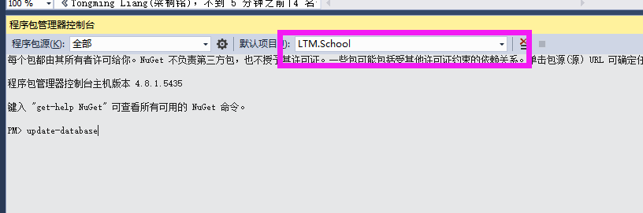

# 欢迎大家来到52ABP学校 

52ABP实战系列教程入门-52ABP学校管理系统

## >预览网址>：https://school.yoyocms.com/

本次课程会使用.NET CORE及EF CORE作为核心技术，带大家做出一个简单的学校管理系统。

SyncToGithub的编译状态：[](https://52abp.visualstudio.com/_apis/public/build/definitions/ca83ba7d-c1a1-4c51-b7e2-d889c38e3d13/3/badge)
 VSTS推送代码到github。


SyncFromGitHub的编译状态：[](https://52abp.visualstudio.com/_apis/public/build/definitions/ca83ba7d-c1a1-4c51-b7e2-d889c38e3d13/4/badge)
Github推送代码到Vsts仓库。

# 从0开始

这可以跟着视频一步一步的完成它。

# 快速启动

如果你电脑没有安装Sqlserver ，那么请修改`appsettings.json`中的信息，使用下面的链接字符串：
``` xml
 "Default": "Server=(localdb)\\mssqllocaldb;Database=ContosoUniversity2;Trusted_Connection=True;MultipleActiveResultSets=true"
```

首先要生成数据库

在程序包管理器控制台执行：`update-database`


# 如何下载

 所有课程的源代码均可以到Github进行下载！

 地址： https://github.com/52ABP/52ABP.School


# 视频教程地址：

腾讯课堂：
https://52abp.ke.qq.com/

视频直达链接：
https://ke.qq.com/course/264279?tuin=2522cdf3

网易云课堂：
http://study.163.com/provider/400000000309007/index.htm


